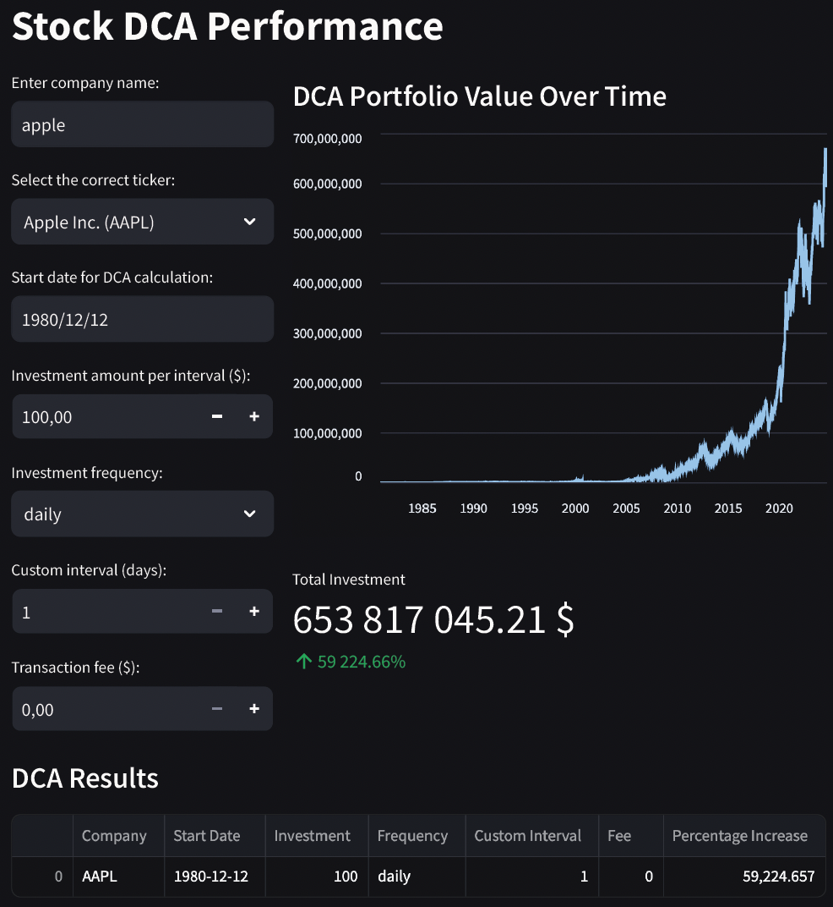

# StockDCA

**StockDCA** is a financial application developed with Streamlit that allows users to visualize stock prices over a specified period and calculate portfolio value using the Dollar-Cost Averaging (DCA) method. Integrated with Yahoo Finance, the application offers a simple interface to track investment performance and perform statistical analysis.


## Features

- **Stock Price Visualization**: Retrieve and display historical stock prices over a selected date range.
- **Dollar-Cost Averaging (DCA) Calculation**: Calculate the value of a portfolio based on regular investments over time.
- **Statistical Analysis**: Analyze the portfolio to determine the optimal buying frequency (e.g., daily, weekly) for maximizing returns on an equity.
- **Interactive Interface**: User-friendly interface powered by Streamlit for easy data input and visualization.

## Installation

To get started with StockDCA, you need to have Python installed on your machine. Then, follow these steps:

1. **Clone the repository**:
    ```bash
    git clone https://github.com/your_username/StockDCA.git
    cd StockDCA
    ```

2. **Create a virtual environment (optional but recommended)**:
    ```bash
    python -m venv venv
    source venv/bin/activate   # On Windows: venv\Scripts\activate
    ```

## Usage

To run the application, execute the following command in your terminal:

```bash
streamlit run StreamlitApp.py
